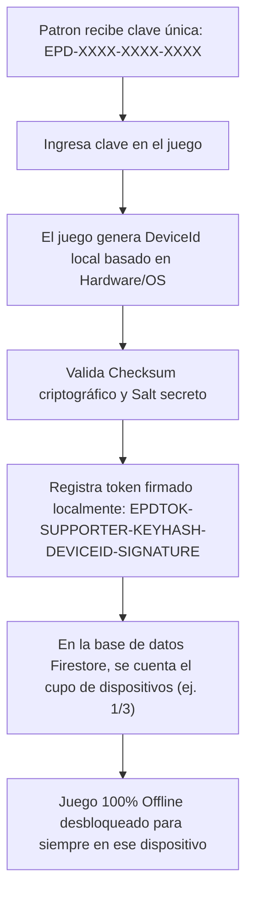

# 🔐 Sistema de Licencias Anti-Piratería y Acceso Total
## Eternity Pixel Dungeon — Documentación Técnica y Guía de Operaciones

---

## 1. Visión General

El sistema de licenciamiento de **Eternity Pixel Dungeon** está unificado en **un solo tipo de Licencia Supporter / Premium con Acceso Total**, que desbloquea todas las características exclusivas presentes y futuras:
- **Nuevo Héroe:** El Bárbaro (*The Barbarian*) y sus subclases.
- **Nueva Mascota Legendaria:** La Mantícora (*The Manticore*).
- **Contenido Premium Adicional** y agradecimientos en los créditos.

### Formas de Obtener Acceso Completo
| Plataforma / Canal | Método de Activación | Beneficios | Dispositivos |
| :--- | :--- | :--- | :---: |
| **Patreon / Clave Directa** | Clave única `EPD-XXXX-XXXX-XXXX` | Acceso Completo a Todo | 3 dispositivos (configurable) |
| **Steam Edition** | Detección Automática Steamworks | Acceso Completo a Todo | Ilimitado en tu cuenta |
| **Google Play Premium** | Detección Automática In-App | Acceso Completo a Todo | Ilimitado en tu cuenta |

---

## 2. Arquitectura de Seguridad Anti-Piratería

### ¿Por qué una clave no puede compartirse masivamente en internet?



1. **Huella Digital del Dispositivo (`SupporterManager.getDeviceId()`)**:
   - Se calcula un hash criptográfico SHA-256 combinando `user.name`, `os.name`, `os.arch` y el identificador de máquina (`COMPUTERNAME` / `HOSTNAME`).
   - El token de activación se firma con el `KEY_SALT` secreto del proyecto y queda **vinculado a ese hardware**.
2. **Protección contra copia de archivos de guardado**:
   - Si un usuario copia su archivo `SPDSettings` a la PC o teléfono de un amigo, el `DeviceId` del amigo no coincidirá con el token firmado y el juego **rechazará el token foráneo automáticamente**.
3. **Límite de Activaciones Simultáneas en Firestore**:
   - Cada clave registrada en Firestore almacena un array `active_devices`.
   - Si una clave es publicada en Discord o Reddit y supera su límite (ej. 3 dispositivos), el servidor bloquea las activaciones adicionales.
4. **Tolerancia Offline**:
   - Una vez activado en los dispositivos legítimos del patron, el juego valida el token local firmado en cada inicio de forma instantánea y **sin requerir conexión a internet**.

---

## 3. Algoritmo Criptográfico de Generación y Validación

### Generación de Claves (`SupporterManager.generateKey`)
```java
String raw = "EPD:" + patronSeed.toUpperCase() + ":" + KEY_SALT;
String hash = sha256Hex(raw).toUpperCase();
String part1 = hash.substring(0, 4);
String part2 = hash.substring(4, 8);
String prefix = "EPD-" + part1 + "-" + part2;

// Checksum matemático ignorando guiones
int sum = 0;
for (char c : prefix.toCharArray()) {
    if (c != '-') sum += c;
}
String checksum = String.format("%04X", sum % 0xFFFF);
String licenseKey = prefix + "-" + checksum;
```

### Generación de Token Vinculado a Dispositivo (`SupporterManager.generateDeviceToken`)
```java
String keyHash = sha256Hex(key + ":" + KEY_SALT).substring(0, 8);
String devPart = deviceId.substring(0, 8);
String rawSign = "SUPPORTER:" + keyHash + ":" + devPart + ":" + KEY_SALT;
String signature = sha256Hex(rawSign).substring(0, 8);
String deviceToken = "EPDTOK-SUPPORTER-" + keyHash + "-" + devPart + "-" + signature;
```

---

## 4. Guía de Operaciones para el Administrador

### ¿Cómo emitir una nueva clave a un nuevo Patrocinador?
1. Inicia sesión en el **Panel de Administración Web**: `https://eternity-pixel-dungeon.web.app/admin/`
2. Ve a la pestaña **🔑 Patreon Licenses**.
3. En el formulario **Issue Universal Supporter License**:
   - **Patron Email**: Ingresa el email o ID del suscriptor (ej. `patron@gmail.com`).
   - **Max Devices**: Establece el cupo (por defecto `3`).
   - **Notes**: Agrega notas opcionales (ej. `Suscripción Patreon`).
4. Haz clic en **⚡ Generate & Register License**.
5. Se generará la clave en pantalla (ej. `EPD-4B8F-9C12-039B`). Haz clic en **📋 Copy Key**.
6. Envía la clave al patrocinador por mensaje privado en Patreon o Discord.

### ¿Cómo gestionar licencias existentes?
- **Resetear Dispositivos (🔄 Reset Devs)**: Si un patrocinador cambió de PC o teléfono, haz clic en este botón para vaciar su lista de dispositivos registrados sin necesidad de emitirle una clave nueva.
- **Revocar Licencia (Revoke / Activate)**: Si un usuario pide reembolso, haz clic en *Revoke* para suspender la clave.

---

## 5. Pruebas Automáticas y Verificación

El sistema está respaldado por pruebas unitarias integradas en `desktop:autoTest`:
- **`SupporterLicensingTest.java`**:
  - `[PASS]` Verificación de estado inicial Standard Edition.
  - `[PASS]` Generación y validación de claves universales `EPD-XXXX-XXXX-XXXX`.
  - `[PASS]` Rechazo estricto de claves alteradas, corruptas o forjadas.
  - `[PASS]` Vinculación de tokens a hardware genuino y rechazo en hardware foráneo.
  - `[PASS]` Ciclo completo de activación y desactivación.
  - `[PASS]` Integración con wrappers de Steamworks e In-App Purchase.
