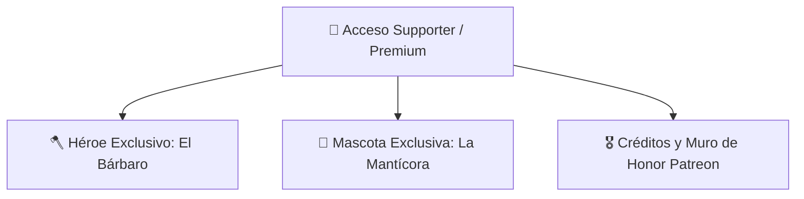

# 🗺️ Eternity Pixel Dungeon — Roadmap de Desarrollo & Mejoras

Documento maestro con la visión técnica, planes por fases, arquitectura y tareas del proyecto **Eternity Pixel Dungeon**.

---

## 🌟 Visión del Proyecto
Transformar *Eternity Pixel Dungeon* en un roguelike comercial de alta calidad y estética prémium, manteniendo el motor de código abierto (GPL v3) desacoplado de una capa de contenido propietario (arte, música, historia, logos) y preparado para su distribución multiplataforma (Steam, itch.io, Web, Móvil).

---

## 🎨 1. Modernización Gráfica HD y Entorno (Completado)

- [x] **Fase 1: Motor HD + Héroes y Avatares**: Soporte en `HeroSprite` para resoluciones estándar y HD 2x para todas las clases y avatares.
- [x] **Fase 2: Ítems y Efectos de Combate**: Sprites de alta definición para armas/armaduras Míticas y Cósmicas con auras y chispas estelares.
- [x] **Fase 3: Criaturas y Jefes Épicos**: Soporte dinámico en `MobSprite` para los 5 jefes principales (Goo, Tengu, DM-300, Rey Enano, Yog-Dzewa).
- [x] **Fase 4: Tilesets de Mazmorras y Entorno HD**: Renderizado de zonas, iluminación, fuentes, trampas y menú retro 16-bit.

---

## 🐾 2. Sistema de Compañeros y Mascotas (*Pets & Companions*)

- [x] **Incubación y Eclosión**: Sistema de huevos raros (`PetEgg`) con calor y pasos en la mazmorra.
- [x] **4 Especies Base de Mascotas**:
  - *Cría de Dragón*: Inmunidad al fuego, mordida ígnea y aliento de llamas.
  - *Araña Tejedora*: Redes inmovilizadoras y veneno debilitante.
  - *Lobo Fiel*: Rastreo de secretos, trampas y mordedura con sangrado crítico.
  - *Hada de Luz*: Curación periódica y revelación luminosa del mapa.
- [x] **Evolución y UI Táctica**: Ventana `WndPet`, 3 etapas evolutivas, alimentación y comandos tácticos.
- [x] **Audio de Eclosión**: Efectos sonoros y rugidos únicos para cada especie al nacer.

---

## 🎮 3. Plataformas, Logros y Distribución (Completado)

- [x] **Arquitectura Desacoplada `PlatformServices`**: Fallback `NullPlatformServices` y wrapper dinámico `SteamworksWrapper`.
- [x] **10 Logros Propietarios**: Integrados con `Badges.java` y sincronizados con tolerancia a fallos offline.
- [x] **Compilación y Soporte Móvil**: Pipeline probado para APK Release de Android y empaquetado nativo Windows.
- [x] **Portal Web Oficial (`WEB_EPD/`)**: Conexión a Firebase Firestore, Devlog CMS bilingüe y descarga directa de versiones.

---

## 🚀 4. Nuevas Iniciativas en Desarrollo (Próximas Fases)

---

### 🪓 Módulo 1: Nuevo Héroe — El Bárbaro (*The Barbarian*)
*Nueva clase de combate cuerpo a cuerpo agresiva centrada en la furia berserker y resistencia al dolor.*
- [ ] **Mecánica Única de Clase**: *Medidor de Furia / Rabia* (acumula daño recibido para potenciar ataques devastadores y velocidad).
- [ ] **Equipamiento Inicial**: Hacha de doble mano tosca, pieles curtidas, cuerno de guerra ancestral.
- [ ] **Árbol de Talentos (Tiers 1 al 4)**: Bonificaciones a supervivencia a baja vida, ruptura de armadura y torbellino de golpes.
- [ ] **Subclases (Nivel 12+)**:
  - *Berserker del Norte*: Desenfreno en combate que ignora efectos de aturdimiento y aumenta el daño crítico a menor salud.
  - *Señor de las Bestias (Beastmaster)*: Sinergia especial potenciada con las mascotas y compañeros.
- [ ] **Sprites y Avatares**: Animaciones en pixel art estándar y HD 2x.

---

### 🦁 Módulo 2: Nueva Mascota Legendaria — La Mantícora (*The Manticore*)
*Compañero híbrido mítico que combina el poder destructivo del Dragón y el control de masas de la Araña.*
- [ ] **Origen y Hallazgo**: Huevo de Mantícora Legendario con brillo carmesí y púrpura.
- [ ] **Habilidades Combinadas Dragón + Araña**:
  - *Aliento de Fuego Carmesí (Dragón)*: Daño ígneo en cono contra grupos de enemigos.
  - *Pinchazo de Cola Venenosa & Redes (Araña)*: Disparo de espinas de aguijón que ralentizan, envenenan e inmovilizan.
  - *Vuelo / Embestida Aérea*: Capacidad de superar obstáculos y abalanzarse sobre objetivos lejanos.
- [ ] **Evolución Triple**: Cría de Mantícora $\rightarrow$ Mantícora Joven $\rightarrow$ Mantícora Imperial Alfa.
- [ ] **Audio y Efectos Visuales**: Rugido felino-reptil exclusivo y partículas de fuego y veneno.

---

### 👑 Módulo 3: Sistema de Licenciamiento y Acceso Supporter / Premium
*Módulo unificado para verificar el derecho de acceso al Bárbaro y la Mantícora en todas las plataformas.*
- [ ] **Canales de Validación Soportados**:
  1. **Steam**: Detección automática mediante `PlatformManager.get().isAvailable()` (compradores del juego en Steam).
  2. **Patreon**: Sistema de canje de Clave de Licencia Supporter / Token de Patrocinador.
  3. **Google Play**: Verificación de compra en la app (Google Play Billing / Versión Premium).
  4. **Clave de Licencia Directa**: Ventana de activación manual para compras directas.
- [ ] **Interfaz de Selección Bloqueada**:
  - Indicador visual elegante con corona dorada en el menú de héroes y huevos de mascota.
  - Ventana informativa que explica cómo desbloquear el contenido apoyando el proyecto.

---

### 🎖️ Módulo 4: Muro de Honor y Créditos de Patrocinadores (*Patreon Wall of Fame*)
*Reconocimiento permanente dentro del juego a la comunidad que apoya el proyecto en Patreon.*
- [ ] **Nueva Sección en Pantalla de Créditos (`AboutScene`)**:
  - Pestaña interactiva de *Patrocinadores de Patreon / Supporter Wall*.
  - Clasificación por categorías de apoyo (*Campeones Supremos*, *Héroes Legendarios*, *Aventureros Místicos*).
- [ ] **Sincronización Dinámica / JSON**:
  - Carga local integrada con fallback a lista remota actualizada desde Firebase.
  - Mención especial en la web oficial (`WEB_EPD`).

---

## 📋 5. Tabla de Prioridades y Plan de Ejecución

| Prioridad | Tarea / Módulo | Componente | Estimación | Estado |
| :---: | :--- | :---: | :---: | :---: |
| 1️⃣ | **Sistema de Licenciamiento y Acceso Supporter / Premium** | `services.platform` / Core | Alta | 🚀 Planificado |
| 2️⃣ | **Mascota Legendaria: La Mantícora (Manticore)** | `actors.mobs.pets` | Alta | 🚀 Planificado |
| 3️⃣ | **Nuevo Héroe: El Bárbaro (Barbarian)** | `actors.hero` / Sprites | Muy Alta | 🚀 Planificado |
| 4️⃣ | **Muro de Honor y Créditos de Patrocinadores (Patreon)** | `scenes.AboutScene` / Web | Media | 🚀 Planificado |

---

*Última actualización: Agosto 2026 — Eternity Pixel Dungeon Team*

## 🔮 5. Análisis de Evolución, QoL e Innovaciones Futuras
Esta sección detalla el plan estratégico de diseño para consolidar a Eternity Pixel Dungeon como una experiencia masiva, altamente rejugable y única combinando las fortalezas técnicas de su motor base y agregando mecánicas modernas de RPG y multijugador.

### 💡 5.1 Innovaciones y Nuevas Mecánicas Principales
- [ ] **Multijugador Cooperativo Simultáneo (Local/Lan):** Implementar la posibilidad de juego cooperativo donde **tú y un amigo** puedan descender simultáneamente la misma mazmorra (pantalla compartida o por conexión IP local/LAN), compartiendo inventario y coordinando ataques.
- [ ] **Fase 2 de Evolución y Equipamiento de Mascotas:** Permitir que los compañeros suban de Tier mediante mezclas alquímicas (ej. Lobo al nivel 10 + Poción Elemental = *Lobo Huargo Elemental*). Añadir ranuras de equipamiento exclusivo para mascotas (Collares/Armaduras ligeras).
- [ ] **Armas de Doble Empuñadura (Dual Wielding) y Colosales:** Complemento perfecto para el Bárbaro. Armas que ocupen slots accesorios o requieran configuración a dos manos, introduciendo la mecánica de "Ataques de Barrido" en área.
- [ ] **Rey Rata Jugable & Subclases Exclusivas:** Evolución total del Rey Rata oculto a clase elegible, con especializaciones como *Señor de la Plaga* (Daño tóxico/corrupción) y *Monarca del Queso* (Supervivencia extrema, control mental de pequeños enemigos e invocación).

### 🛠️ 5.2 Mejoras de Calidad de Vida (QoL) - Prioridades
- [ ] **🚨 ALTA PRIORIDAD: Ausencia de Colisión para Mascotas:** Desactivar el *blocking* sólido entre el héroe y su mascota, permitiendo a los jugadores intercambiar posición de manera táctica sin quedar atascados en pasillos estrechos.
- [ ] **Panel Táctico Rápido (HUD):** Una barra minimalista persistente en la pantalla de juego que permite asignar órdenes (Atacar, Seguir, Retirada) directamente sin tener que abrir el panel completo del inventario.
- [ ] **Botón de Registro y Loadouts (Salón de la Fama):** Perfil de personaje que expone el equipamiento exacto que usaste en tus victorias (Armas, anillos, artefactos), vinculándolo al perfil online del Battle Pass.
- [ ] **Diario Expandido de Lore:** Implementar fragmentos de historia en forma de diarios caídos, que profundicen en la historia del Bárbaro, el lore musical exclusivo y el origen secreto del Rey Rata.

### 🎲 5.3 Eventos del Mundo y Dinamismo de Partida
- [ ] **Sucesos Climáticos y Modificadores de Mazmorra:** Implementación de eventos globales con duración limitada (ej. *Maldición de la Humedad*, *Esporas Mutantes*) para forzar la adaptación del héroe en cada piso.
- [ ] **Jefes Alternativos (Variantes):** Sustituir el 100% de predictibilidad por un sistema condicional. Ejemplo: probabilidad de encontrar una versión mutada de fuego del *Goo*, o un *Tengu de Hielo*, promoviendo preparación flexible por parte del jugador.
- [ ] **Temporadas Narrativas integradas al Battle Pass:** Tematización activa. Si está activa la temporada *Luna de Sangre*, enemigos básicos cambian estética, comportamientos y recompensan con monedas de evento al ser derrotados.

### 🔄 5.4 Rebalanceo Asistido por IA y Ritmo de Juego
- [ ] **Retos Semanales Integrados por IA:** Utilización directa del framework *AutoTestRunner / AutonomousBotSim* en servidor para generar desafíos imposibles e iterarlos. Si el bot halla un camino viable para la victoria, esa "seed" se lanza como desafío global diario/semanal.
- [ ] **Identificación Táctica Dinámica:** Nuevo rol económico para suavizar picos negativos de RNG; cuantas más veces utilices un arma u objeto consistentemente, más rápido ganarás su entendimiento empírico como personaje, complementando a los Pergaminos de Identificación clásicos.

### 🎨 5.5 Extensión Cosmética, Modding y Modding UI
- [ ] **Cosméticos, Temas de Interfaz y Sprites Alternativos:** Progresión del Battle Pass para ganar estéticas de interfaz visual (ej. *Marco Dorado Demoniaco*), partículas de movimiento exclusivas o apariencias base alternativas para Héroes (Magos oscuros, Bárbaros tribales).

## ✨ 6. Modernización Gráfica y Visual Avanzada (Motor Renderizado)
Aprovechando la base en LibGDX y OpenGL ES, se expandirán las capacidades gráficas manteniendo intacta el alma Pixel-Art del juego:

### 🌈 6.1 Post-Procesamiento (Shaders)
- [ ] **Bloom (Resplandor):** Efectos de emisión de luz en tiempo real para lava, magia y fuentes de luz extremas.
- [ ] **Vignette & Color Grading (LUTs):** Filtros dinámicos de color y oscurecimiento de bordes según la topología del nivel y los eventos.

### 💡 6.2 Iluminación Dinámica 2D (Raycasting)
- [ ] **Sombras Direccionales Suaves:** Integración de iluminación avanzada para que antorchas y personajes proyecten sombras dinámicas contra los muros.
- [ ] **Efectos Volumétricos:** Rayos de luz crepuscular ("God Rays") entrando desde grietas superiores del entorno.

### 🌫️ 6.3 Sistemas de Partículas y Ambientes Densos
- [ ] **Niebla Interactiva:** Bruma a ras de suelo que reacciona de forma fluida a los pasos del personaje.
- [ ] **Scrolling Parallax Avanzado:** Fondos de profundidad múltiple en los Abismos (Chasms) para simular verdadera sensación de vértigo y escala 3D.
- [ ] **Detalle Ambiental:** Partículas atmosféricas constantes como polvo, gotas o ascuas dependiendo del bioma.

### 🗺️ 6.4 Materiales y Mejoras 2.5D
- [ ] **Normal Mapping (Falso 3D):** Mapas de relieve para entidades y paredes, logrando que la luz dinámica asimile volumen real en 3D sobre sprites 2D.
- [ ] **Smooth FPS & Tweens:** Suavizado de transiciones y frames intermedios para generar animaciones mucho más fluidas y reactivas.

