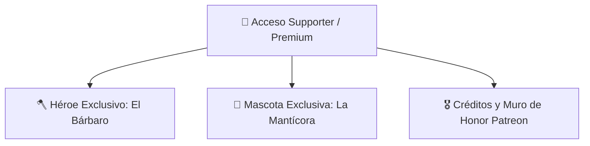

# 🗺️ Eternity Pixel Dungeon — Roadmap de Desarrollo & Mejoras

Documento maestro con la visión técnica, planes por fases, arquitectura y tareas del proyecto **Eternity Pixel Dungeon**.

---

## 🌟 Visión del Proyecto
Transformar *Eternity Pixel Dungeon* en un roguelike comercial de alta calidad y estética prémium, manteniendo el motor de código abierto (GPL v3) desacoplado de una capa de contenido propietario (arte, música, historia, logos) y preparado para su distribución multiplataforma (Steam, itch.io, Web, Móvil).

---

## 🎨 1. Modernización Gráfica HD y Entorno (Completado)

- [x] **Fase 1: Motor HD + Héroes y Avatares**: Soporte en `HeroSprite` para resoluciones estándar y HD 2x para todas las clases y avatares.
- [x] **Fase 2: Ítems y Efectos de Combate**: Sprites de alta definición para armas/armaduras Míticas y Cósmicas con auras y chispas estelares.
- [x] **Fase 3: Criaturas y Jefes Épicos**: Soporte dinámico en `MobSprite` para los 5 jefes principales (Goo, Tengu, DM-300, Rey Enano, Yog-Dzewa).
- [x] **Fase 4: Tilesets de Mazmorras y Entorno HD**: Renderizado de zonas, iluminación, fuentes, trampas y menú retro 16-bit.

---

## 🐾 2. Sistema de Compañeros y Mascotas (*Pets & Companions*)

- [x] **Incubación y Eclosión**: Sistema de huevos raros (`PetEgg`) con calor y pasos en la mazmorra.
- [x] **4 Especies Base de Mascotas**:
  - *Cría de Dragón*: Inmunidad al fuego, mordida ígnea y aliento de llamas.
  - *Araña Tejedora*: Redes inmovilizadoras y veneno debilitante.
  - *Lobo Fiel*: Rastreo de secretos, trampas y mordedura con sangrado crítico.
  - *Hada de Luz*: Curación periódica y revelación luminosa del mapa.
- [x] **Evolución y UI Táctica**: Ventana `WndPet`, 3 etapas evolutivas, alimentación y comandos tácticos.
- [x] **Audio de Eclosión**: Efectos sonoros y rugidos únicos para cada especie al nacer.

---

## 🎮 3. Plataformas, Logros y Distribución (Completado)

- [x] **Arquitectura Desacoplada `PlatformServices`**: Fallback `NullPlatformServices` y wrapper dinámico `SteamworksWrapper`.
- [x] **10 Logros Propietarios**: Integrados con `Badges.java` y sincronizados con tolerancia a fallos offline.
- [x] **Compilación y Soporte Móvil**: Pipeline probado para APK Release de Android y empaquetado nativo Windows.
- [x] **Portal Web Oficial (`WEB_EPD/`)**: Conexión a Firebase Firestore, Devlog CMS bilingüe y descarga directa de versiones.

---

## 🚀 4. Nuevas Iniciativas en Desarrollo (Próximas Fases)

---

### 🪓 Módulo 1: Nuevo Héroe — El Bárbaro (*The Barbarian*)
*Nueva clase de combate cuerpo a cuerpo agresiva centrada en la furia berserker y resistencia al dolor.*
- [ ] **Mecánica Única de Clase**: *Medidor de Furia / Rabia* (acumula daño recibido para potenciar ataques devastadores y velocidad).
- [ ] **Equipamiento Inicial**: Hacha de doble mano tosca, pieles curtidas, cuerno de guerra ancestral.
- [ ] **Árbol de Talentos (Tiers 1 al 4)**: Bonificaciones a supervivencia a baja vida, ruptura de armadura y torbellino de golpes.
- [ ] **Subclases (Nivel 12+)**:
  - *Berserker del Norte*: Desenfreno en combate que ignora efectos de aturdimiento y aumenta el daño crítico a menor salud.
  - *Señor de las Bestias (Beastmaster)*: Sinergia especial potenciada con las mascotas y compañeros.
- [ ] **Sprites y Avatares**: Animaciones en pixel art estándar y HD 2x.

---

### 🦁 Módulo 2: Nueva Mascota Legendaria — La Mantícora (*The Manticore*)
*Compañero híbrido mítico que combina el poder destructivo del Dragón y el control de masas de la Araña.*
- [ ] **Origen y Hallazgo**: Huevo de Mantícora Legendario con brillo carmesí y púrpura.
- [ ] **Habilidades Combinadas Dragón + Araña**:
  - *Aliento de Fuego Carmesí (Dragón)*: Daño ígneo en cono contra grupos de enemigos.
  - *Pinchazo de Cola Venenosa & Redes (Araña)*: Disparo de espinas de aguijón que ralentizan, envenenan e inmovilizan.
  - *Vuelo / Embestida Aérea*: Capacidad de superar obstáculos y abalanzarse sobre objetivos lejanos.
- [ ] **Evolución Triple**: Cría de Mantícora $\rightarrow$ Mantícora Joven $\rightarrow$ Mantícora Imperial Alfa.
- [ ] **Audio y Efectos Visuales**: Rugido felino-reptil exclusivo y partículas de fuego y veneno.

---

### 👑 Módulo 3: Sistema de Licenciamiento y Acceso Supporter / Premium
*Módulo unificado para verificar el derecho de acceso al Bárbaro y la Mantícora en todas las plataformas.*
- [ ] **Canales de Validación Soportados**:
  1. **Steam**: Detección automática mediante `PlatformManager.get().isAvailable()` (compradores del juego en Steam).
  2. **Patreon**: Sistema de canje de Clave de Licencia Supporter / Token de Patrocinador.
  3. **Google Play**: Verificación de compra en la app (Google Play Billing / Versión Premium).
  4. **Clave de Licencia Directa**: Ventana de activación manual para compras directas.
- [ ] **Interfaz de Selección Bloqueada**:
  - Indicador visual elegante con corona dorada en el menú de héroes y huevos de mascota.
  - Ventana informativa que explica cómo desbloquear el contenido apoyando el proyecto.

---

### 🎖️ Módulo 4: Muro de Honor y Créditos de Patrocinadores (*Patreon Wall of Fame*)
*Reconocimiento permanente dentro del juego a la comunidad que apoya el proyecto en Patreon.*
- [ ] **Nueva Sección en Pantalla de Créditos (`AboutScene`)**:
  - Pestaña interactiva de *Patrocinadores de Patreon / Supporter Wall*.
  - Clasificación por categorías de apoyo (*Campeones Supremos*, *Héroes Legendarios*, *Aventureros Místicos*).
- [ ] **Sincronización Dinámica / JSON**:
  - Carga local integrada con fallback a lista remota actualizada desde Firebase.
  - Mención especial en la web oficial (`WEB_EPD`).

---

## 📋 5. Tabla de Prioridades y Plan de Ejecución

| Prioridad | Tarea / Módulo | Componente | Estimación | Estado |
| :---: | :--- | :---: | :---: | :---: |
| 1️⃣ | **Sistema de Licenciamiento y Acceso Supporter / Premium** | `services.platform` / Core | Alta | 🚀 Planificado |
| 2️⃣ | **Mascota Legendaria: La Mantícora (Manticore)** | `actors.mobs.pets` | Alta | 🚀 Planificado |
| 3️⃣ | **Nuevo Héroe: El Bárbaro (Barbarian)** | `actors.hero` / Sprites | Muy Alta | 🚀 Planificado |
| 4️⃣ | **Muro de Honor y Créditos de Patrocinadores (Patreon)** | `scenes.AboutScene` / Web | Media | 🚀 Planificado |

---

*Última actualización: Agosto 2026 — Eternity Pixel Dungeon Team*
