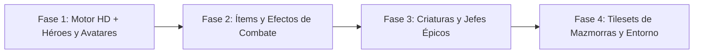
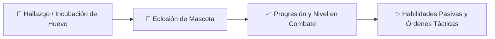

# 🗺️ Eternity Pixel Dungeon — Roadmap de Desarrollo & Mejoras

Documento maestro con la visión técnica, planes por fases, arquitectura y tareas pendientes para el desarrollo de **Eternity Pixel Dungeon**.

---

## 🌟 Visión del Proyecto
Transformar *Eternity Pixel Dungeon* en un roguelike comercial de alta calidad y estética prémium, manteniendo el motor de código abierto (GPL v3) desacoplado de una capa de contenido propietario (arte, música, historia, logos) y preparado para su distribución multiplataforma (Steam, itch.io, Web, Móvil).

---

## 🎨 1. Roadmap de Modernización Gráfica HD (16x16 a 32x32 px)

El motor gráfico evoluciona hacia una **densidad 2x (HD Pixel Art)** sin alterar la lógica de juego, movimiento por turnos, pathfinding ni colisiones.

### ⚔️ Fase 1: Motor HD + Héroes y Avatares (Completado)
- [x] Adaptación del cargador `AssetPackResolver` para soportar assets prioritarios en `packages/eternity/`.
- [x] Soporte dinámico en `HeroSprite` para resoluciones estándar (12x15) y HD 2x (24x30 / 32x32).
- [x] Rediseño visual del **Guerrero (Warrior)** con mandoble a la espalda, capa carmesí, hombreras y tajo luminoso.
- [x] Rediseño visual del **Mago (Mage)** con báculo arcano luminoso, capa zafiro y ráfaga mágica.
- [x] Rediseño visual del **Pícaro (Rogue)** con dagas dobles en la cadera, capa sombría y estocada venenosa.
- [x] Rediseño visual de la **Cazadora (Huntress)** con arco élfico curvado, carcaj de flechas y disparo soplado de viento.
- [x] Rediseño visual de la **Duelista (Duelist)** con estoque de esgrima dorado, capa lateral y estocada relámpago.
- [x] Rediseño visual del **Clérigo (Cleric)** con maza solar bendita, estola sagrada y golpe solar divino.
- [x] Rediseño de los 6 avatares de selección de clase en alta resolución ([`avatars.png`](file:///d:/Desarollo/InfinityPixelDungeon/Infinite-Pixel-Dungeon/core/src/main/assets/packages/eternity/sprites/avatars.png)).

### 🗡️ Fase 2: Ítems y Efectos de Combate (En Progreso)
- [x] Soporte dinámico en `ItemSpriteSheet` para resolución estándar e ítems HD 2x (32x32 px).
- [x] Efectos visuales de impacto y partículas de combate (chispas estelares en golpes críticos y sigilosos).
- [ ] Sprites de alta definición para armas y armaduras Legendarias y Míticas con brillo y runas grabadas.

### 👹 Fase 3: Criaturas y Jefes Épicos (En Progreso)
- [x] Soporte dinámico en `MobSprite` para resolución estándar y texturas HD 2x automáticas.
- [x] Adaptación de los 5 Jefes Principales a la arquitectura de resolución dinámica:
  - **Goo**: `GooSprite` con soporte HD 2x.
  - **Tengu**: `TenguSprite` con soporte HD 2x.
  - **DM-300**: `DM300Sprite` con soporte HD 2x.
  - **Rey Enano (King of Dwarves)**: `KingSprite` con soporte HD 2x.
  - **Yog-Dzewa & Puños**: `YogSprite` y `FistSprite` con soporte HD 2x.

### 🏰 Fase 4: Tilesets de Mazmorras y Entorno (Próximo)
- [ ] Tilesets personalizados para las zonas de la mazmorra.
- [ ] Objetos interactivos (Cofres dorados, trampas con grabado, fuentes de vida, puertas ornamentadas).
- [x] Conservación intacta de las pantallas de carga y splashes personalizados creados por el usuario en `splashes/`.

---

## 📦 2. Capa Propietaria y Licenciamiento Comercial

- **Motor GPL v3**: Código fuente base libre y modular.
- **Capa Desacoplada (`packages/eternity/`)**:
  - `branding/`: Logotipos comerciales, banners y emblemas.
  - `music/`: Pistas musicales originales de autor.
  - `story/`: Textos narrativos, diálogos y lore exclusivo.
  - `sprites/`: Sprites de héroes, efectos y criaturas propietarias.
- **Resolución Transparente (`AssetPackResolver`)**:
  - Búsqueda con prioridad en `packages/eternity/` y fallback automático a `assets/`.

---

## 🎮 3. Integración de Plataforma y Steamworks

- **Arquitectura**: [`PlatformServices`](file:///d:/Desarollo/InfinityPixelDungeon/Infinite-Pixel-Dungeon/core/src/main/java/com/shatteredpixel/shatteredpixeldungeon/services/platform/PlatformServices.java) con fallback seguro [`NullPlatformServices`](file:///d:/Desarollo/InfinityPixelDungeon/Infinite-Pixel-Dungeon/core/src/main/java/com/shatteredpixel/shatteredpixeldungeon/services/platform/NullPlatformServices.java) y wrapper dinámico [`SteamworksWrapper`](file:///d:/Desarollo/InfinityPixelDungeon/Infinite-Pixel-Dungeon/core/src/main/java/com/shatteredpixel/shatteredpixeldungeon/services/platform/SteamworksWrapper.java).
- **Características Soportadas**:
  - [x] Desbloqueo de Logros (*Achievements*).
  - [x] Guardado en la Nube (*Cloud Saves*).
  - [x] Presencia Enriquecida (*Rich Presence* - ej. "Nivel 14 - Clérigo").
  - [x] Estadísticas en la nube (*Leaderboards & Stats*).

---

## 🌐 4. Plataforma Web y Devlog CMS (`WEB_EPD/`)

- **Portal Web Oficial**:
  - [x] Diseño responsivo bilingüe (Español / Inglés).
  - [x] Explorador interactivo de héroes, lore y mecánicas.
  - [x] Registro y descarga directa de versiones para Windows.
  - [x] Vitrina interactiva de Mascotas y Compañeros con arte en alta definición.
- **Blog y Devlog en Tiempo Real**:
  - [x] Conexión a Firebase Firestore (`eternitypd`) con soporte bilingüe.
  - [x] Integración de notas de versión oficiales permanentes (`v0.2.3`, `v0.2.2`, `v0.2.1`).
  - [x] Panel de administración en la nube (`admin/`) para redactar y publicar posts con imágenes.

---

## 🐾 5. Sistema de Compañeros y Mascotas (*Pets & Companions*)

Inspirado en las mecánicas de compañeros de *Remixed Dungeon* (NYRDS), adaptado a la arquitectura moderna y visuales HD de *Eternity Pixel Dungeon*.

### 🥚 Características Clave del Sistema:
- [x] **Incubación y Eclosión**: Ítems de huevos raros (`PetEgg`) con acciones de calentar e incubación por pasos en la mazmorra.
- [x] **Variedad de Mascotas**:
  - *Cría de Dragón*: Inmunidad al fuego, mordida ígnea y aliento de llamas.
  - *Araña Tejedora*: Redes inmovilizadoras y veneno debilitante.
  - *Can Fiel / Lobo*: Rastreo de secretos, trampas y mordedura con sangrado crítico.
  - *Espíritu de Luz / Hada*: Curación periódica y revelación luminosa del mapa.
- [x] **Progresión de la Mascota**: Ganancia de experiencia compartida al combatir, aumento de atributos y evolución en 3 etapas (*Cría* $\rightarrow$ *Joven* $\rightarrow$ *Adulto*).
- [x] **Comandos Tácticos & UI**:
  - Ventana táctica interactiva (`WndPet`) con órdenes directas (*Seguir*, *Defender*).
  - Sistema de alimentación con carnes, raciones y pociones de salud.
  - Renombrado de mascota y barras de salud/exp.
- [x] **Vitrina Web y Emblemas HD**: Integración en `WEB_EPD/` con marcos de runas místicas.

---

## 📋 6. Backlog de Tareas Pendientes

| Prioridad | Tarea | Componente | Estado |
| :---: | :--- | :---: | :---: |
| 🔥 Alta | Sprites HD para armas y armaduras Legendarias y Míticas | Gráficos | Pendiente |
| 🔥 Alta | Música original de autor para el Menú Principal y Cloacas | Audio | Pendiente |
| ⚡ Media | Sistema de Logros de Steam mapeados con los Badges del juego | Plataforma | Pendiente |
| ⚡ Media | Tilesets de Mazmorras y Entorno HD | Gráficos | Pendiente |
| ✅ Completado | **Sistema de Compañeros y Mascotas (*Pets & Companions*)** | Mecánicas / Core | ✅ Implementado |
| ✅ Completado | **Soporte de Renderizado Dinámico HD para Ítems y Jefes** | Motor / Gráficos | ✅ Implementado |

---

*Última actualización: Agosto 2026 — Eternity Pixel Dungeon Team*
